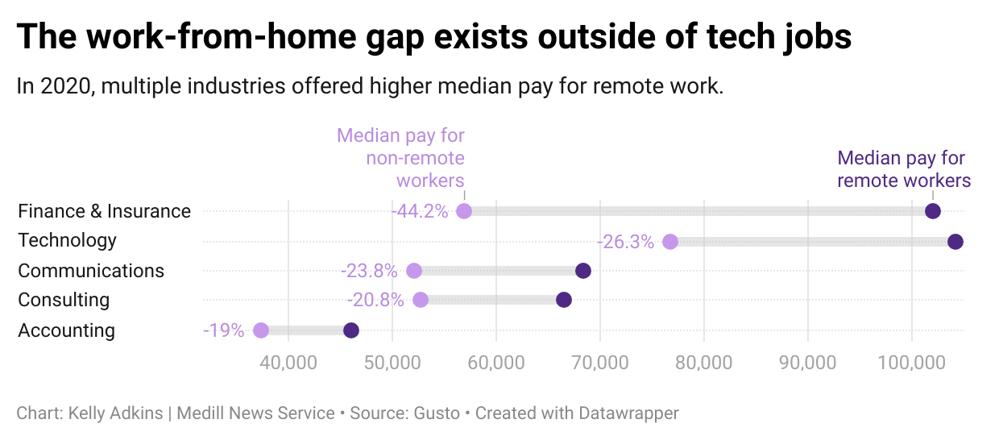

Kelly Adkins
23-datajournalism
FINAL PROJECT 

# What’s the story?

Remote work has continued to grow in post-pandemic U.S. according to data from the Census Bureau American Community Survey, 2022. With it being the new norm, it could impact job-seekers’ relocation or industry of choice and wage-setting by employers. 

The Washington Post reported that [over a third]( https://www.washingtonpost.com/dc-md-va/2023/09/14/dc-remote-work-jobs-data-census-bureau/) of D.C. residents worked from home in 2022. While this is a decline since 2021, this data will serve as a more reliable baseline in the post-pandemic years to come. It turns out, the District of Columbia is simply following suit in the national trend. 

In 2022, work from home workers took up 15% of the commuting style according to the American Community Survey (ACS). In comparison to the 16% of all other commute types – that is a substantial portion of working Americans. In the past 4 years remote work has continuously rivaled other commute types, despite seeing a slight decrease since 2021.

.png>)
 
https://www.datawrapper.de/_/ZamfZ/

Hired, career marketplace specializing in tech and sales that matches talent with a company, released its 2022 State of Tech Salaries report, which included integral data to understand how remote salaries – on average – in America and leading countries have changed, and compares it to the technology industry primarily. Although, there are bouts of good data in there for other industries. 

A key finding was that the percentage ratio of average salaries for remote work to on-site was [higher]( https://www.datawrapper.de/_/DRktU/) in big tech cities. The report also identified the top five cities working in tech were San Francisco, Seattle, New York, Boston and Austin. 

The tech industry is notorious for hosting remote-only or remote-dominated teams, even before the pandemic. It poses the question: would the percentage of remote workers in tech cities outweigh others? 

The national average of remote workers in 2022 was 15%. Comparing that to the percentages in the most populated cities in America and the largest tech working cities in America can demonstrate two of the extremes of this spectrum.

Using some more digging of Census Bureau ACS data, I was able to find the work-from-home employees per city. I isolated it to the most populous cities – which were [indentified by](https://www.census.gov/newsroom/press-releases/2023/subcounty-metro-micro-estimates.html) a Census report as Houston, Los Angeles, Phoenix, Chicago and New York City, then I found the [corresponding data](https://www.census.gov/data/tables/time-series/demo/popest/2020s-total-cities-and-towns.html) – and the biggest tech cities, named above.

It turns out, population does play an impact on work-from-home employees. 

<noscript></noscript>

 
https://datawrapper.dwcdn.net/dCIkt/2/ 

This kind of already makes sense, though, because of per capita assumptions. Let’s look at how they directly compare. 
 

<noscript></noscript>

https://datawrapper.dwcdn.net/aO32f/1/ 

 
<noscript></noscript>

https://datawrapper.dwcdn.net/tESAs/1/ 

While tech cities still sit way above the national percentage, it is less of a gap that the most populated cities give. 

# More depth and possible stories

1. 	Where has tech work increased the most, and been the most popular among job-seekers, and has this been reflective in a higher average of remote workers, per city? 

The average tech salary in San Francisco could be worth more in most large cities, except New York. 

 https://www.datawrapper.de/_/dY8GY/ 

Why is this? It chalks up to cost of living, as anticipated. 

Of these 8 cities, could average salary growth be increasing due to the type of companies? 

 

[Link to visualization](https://datawrapper.dwcdn.net/ztHt8/3/)

2. 	How has the pandemic kick-started remote work in “atypical” cities (less populated, less tech-heavy)

According to [Gusto study]( https://gusto.com/company-news/remote-hiring-brings-jobs-and-higher-pay-to-small-and-medium-cities-across-the-us), the average remote worker (in all professional service industries) makes 17-58% more than on-site when compared to the same industry and zip code. Other findings include: 
*	Before March 2020, 38% of all hiring was in: New York City, Los Angeles, Chicago, San Francisco, and District of Columbia. These cities were also the five largest metro areas by GDP.
*	After March 2020, San Francisco/New York/Boston/Los Angeles all lost their remote work market share, and smaller cities picked up some

When it says 38% of all hiring was in the 5 largest metro areas by GDP, Gusto measured how many companies used its services for hiring individuals. When analyzing this data, they found that the following cities received an increase in hiring measures through the company: Memphis, Tampa, Colorado Springs, Houston, Dallas, and Des Moines.

.png>)
https://datawrapper.dwcdn.net/0ecUL/2/

https://datawrapper.dwcdn.net/Q9kXX/2/ 

3. 	How are employers using remote work to incentivize job-seekers and cut their own costs?

A 2022 [study]( https://www.nber.org/system/files/working_papers/w30197/w30197.pdf)  conducted by the National Bureau of Economic research sought out to find what was influencing wage-setting behavior in the U.S.. The below data is sourced from the Survey of Business Uncertainty, conducted by the Federal Reserve Bank of Atlanta, Stanford University, and the University of Chicago Booth School of Business. 

Some key findings: 
*	In 2022, Work types influenced the shift to remote work, where 82 responses were given that it was associated with more part-time, independent contractors, leased workers, domestic outsourcing, offshoring, and employment of the physically-challenged 
*	Remote work or work-from-home positions were used to incentivize job-seekers and current hires

[Link to study](https://www.nber.org/system/files/working_papers/w30197/w30197.pdf) | //add link to spreadsheet with page name

# Methodology (Mine)

*	Use the “economic characteristics” filter of the 2022 American Community Survey (ACS, Census Bureau) to find the commuting style of Americans. It comes broken down into: Drove (alone), Drove (carpool), Worked from Home, Walked, Transit (non-taxi), and other. 
*	Also get the ACS survey with economic characteristics from 2019, 2020, 2021. 
*	Find the most populated cities as of 2022, also from the [Census Bureau]( https://www.census.gov/newsroom/press-releases/2023/subcounty-metro-micro-estimates.html). Add the top 5 (to match top 5 tech cities) by city name and population to a master spreadsheet.
*	Filter the economic characteristics by the cities I needed to take a look at (most populated and largest tech cities). Source the commuting style per city and add it to a master spreadsheet. Also find the population reported for 2022 of the largest tech cities for comparison, using Census data. ( https://www.census.gov/data/tables/time-series/demo/popest/2020s-total-cities-and-towns.html#v2022). This data is by state, so I had to filter by city.
*	See my [filtered data](https://data.census.gov/table/ACSDP1Y2022.DP03?q=DP03&g=010XX00US_050XX00US04013_160XX00US0455000,0644000,0667000,1714000,2507000,3651000,4805000,4835000,5363000&y=2022) 
*	Clean data to create a symbol map that shows WFH per each city in color, and population in size. 
*	Clean data again to make two stacked bar graphs that compare the population to industry by percentage points. Calculate the percentage points of each commuting style per city based on the data, using a percentage formula. Use ChatGPT to double-check the math, because #factchecking 

Note: Only primary methology included. I did not list my methodology for my additional background reporting (correlated to the section “More depth and possible stories”). 

# Methodology (Sources)

1. 	American Community Survey – [Read about it]( https://www.census.gov/acs/www/methodology/sample_size_and_data_quality/) on the Census Bureau site.
2. 	Census Population Stats – [Read about it]( https://www2.census.gov/programs-surveys/popest/technical-documentation/methodology/2020-2022/2022-subco-meth.pdf) on the Census Bureau site.
3. 	Hired – The methodology of the report is gathered from Hired’s proprietary data and what they call “real interview requests,” which seems to be people who actively used the marketplace to get job placement, instead of passively. Hired also used the salaries received by these interviewers. There are 17 different markets represented in the US, UK, Canada. Analysis included “907,000 interview requests across over 47,750 active positions facilitated through our marketplace from January 2019 through June 2022 (Q2 2022).” Numbeo was used for cost of living analysis to factor in rent, real estate, groceries, transportation, utilities, local taxes, etc. Surveys of 2,000+ global tech professionals were also conducted for the qualitative data.
4.  	Gusto – Gusto is an B2B economic data tool with products for online payroll software, HR admin, and more. It is geared towards small business and startups. Gusto also employs economists that investigated “the changes that remote and hybrid work have brought to the workplace.” It’s report focuses on the relocation of workers in this relationship. The methodology of the report includes a sample of companies using Gusto. The sample includes 35,858 companies over March 2019 and March 2022. Professional service analysis includes the classification: technology, legal, finance, communications, consulting, insurance, accounting, other professional services.
5. 	National Bureau of Economic Research – Conducted by the National Bureau of Economic research, sought out to find what was influencing wage-setting behavior in the U.S.. The data is sourced from the Survey of Business Uncertainty, conducted by the Federal Reserve Bank of Atlanta, Stanford University, and the University of Chicago Booth School of Business. They sampled “firms” in qualitative and quantitative means.

# Next Data Steps

Dive deeper into the Census data, and find enough to create a choropleth map per each major city in the U.S., and compare it to the national WFH average. 

